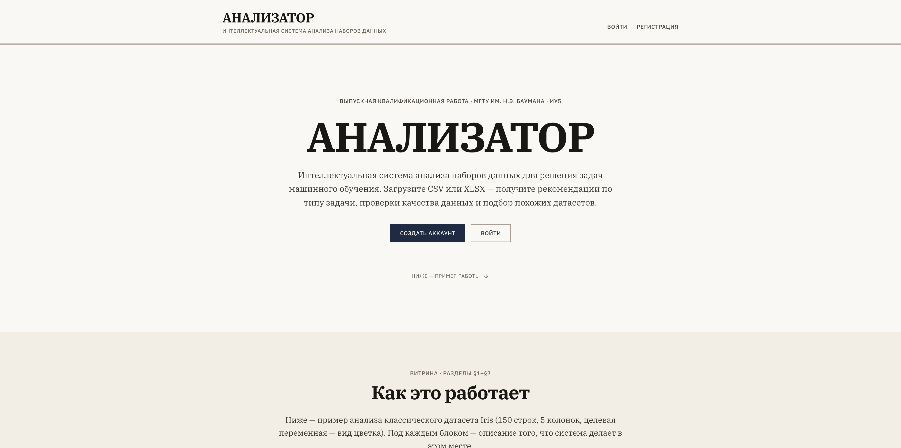
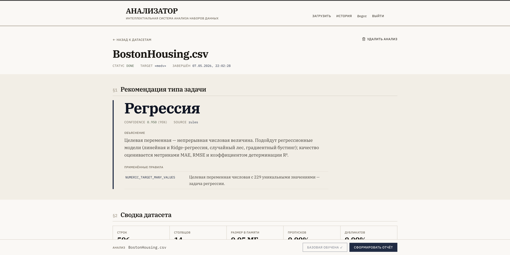
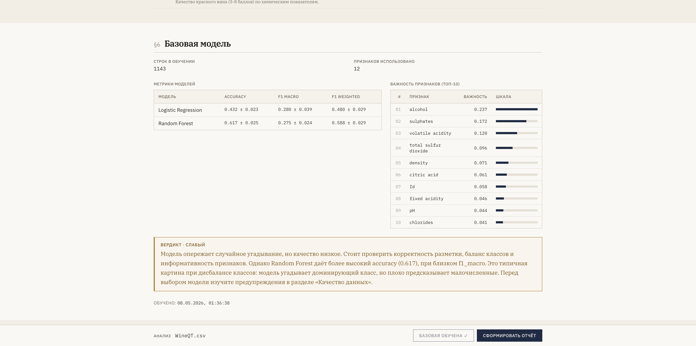
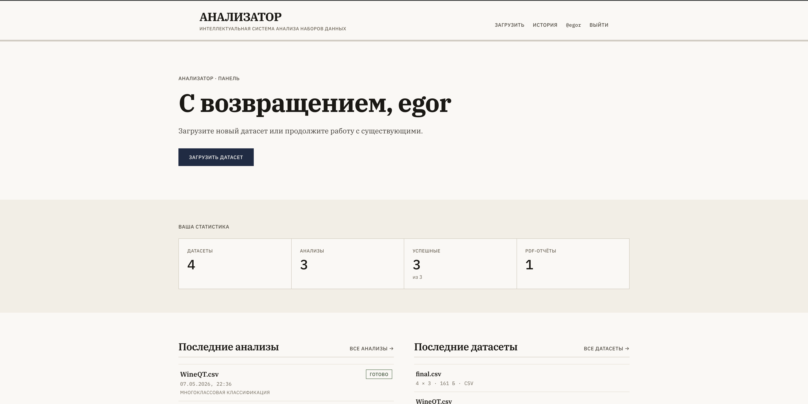

# Анализатор

ВКР · МГТУ им. Н.Э. Баумана · ИУ5 · 2026

Анализатор — веб-приложение, которое автоматизирует первичную диагностику табличных датасетов перед использованием в задачах машинного обучения. Загрузите CSV или XLSX, и система выполнит профайлинг данных, выявит проблемы качества (пропуски, выбросы, утечки целевой переменной), порекомендует тип ML-задачи с обоснованием, найдёт похожие датасеты в каталоге и обучит базовую модель.

Целевая аудитория — студенты и начинающие аналитики данных, которым важно понять «что у меня в датасете» до того как тратить часы на построение моделей.

Выпускная квалификационная работа бакалавра, МГТУ им. Н.Э. Баумана, кафедра ИУ5, 2026.

## Возможности

- Загрузка и профайлинг табличных данных (CSV, XLSX до 100 МБ).
- 12 правил проверки качества данных (пропуски, выбросы, утечки, кардинальность).
- Двухслойная рекомендация типа ML-задачи (правила + meta-классификатор на 16 признаках).
- Поиск похожих датасетов через косинусную меру в pgvector с HNSW-индексом.
- Обучение базовых моделей (LogisticRegression / Ridge / RandomForest) с 5-fold кросс-валидацией.
- Генерация PDF-отчёта (профайл + флаги + графики + рекомендация + метрики).
- Админ-панель со статистикой и управлением пользователями.

## Скриншоты









## Технологический стек

- **Backend:** Python 3.11, FastAPI, SQLAlchemy 2 + Alembic, PostgreSQL 15 + pgvector, scikit-learn, WeasyPrint.
- **Frontend:** React 19 + TypeScript, Vite 8, Tailwind CSS 3, Plotly, lucide-react.
- **Тесты:** pytest (backend), vitest + React Testing Library (frontend).
- **Развёртывание:** Docker Compose.

## Запуск

```bash
make up           # docker compose up -d
make migrate      # alembic upgrade head
make test         # pytest
```

После запуска интерфейс доступен на <http://localhost:3000>, документация API — на <http://localhost:8000/api/docs>.

## Лицензия

MIT (см. [LICENSE](LICENSE)).
